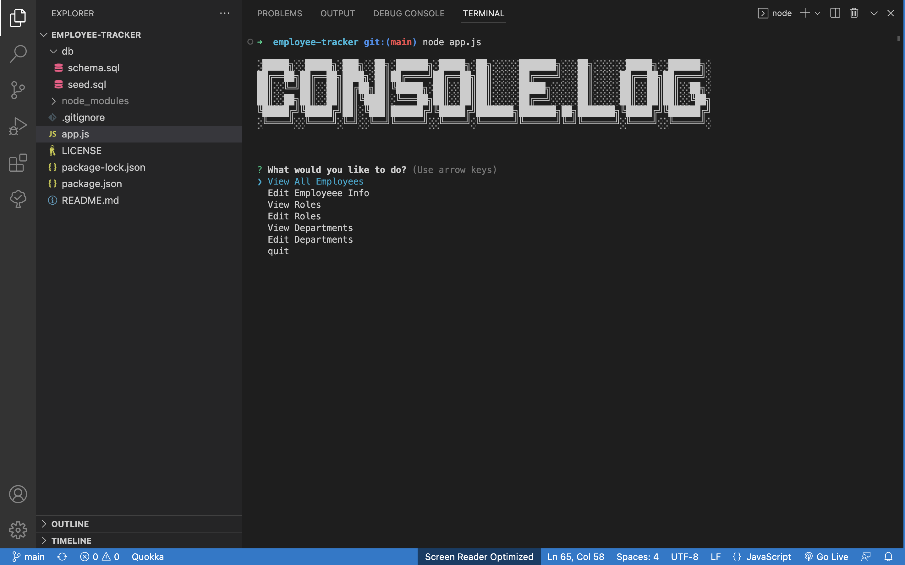
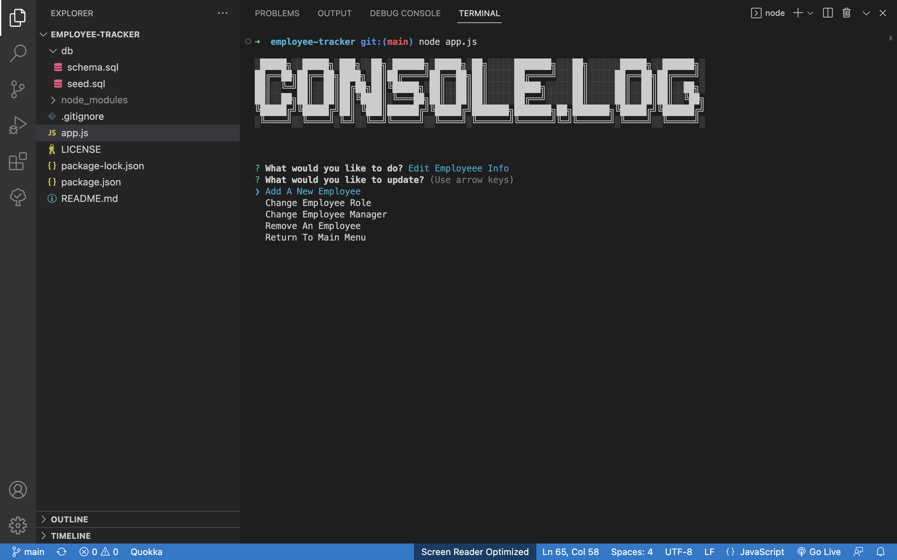
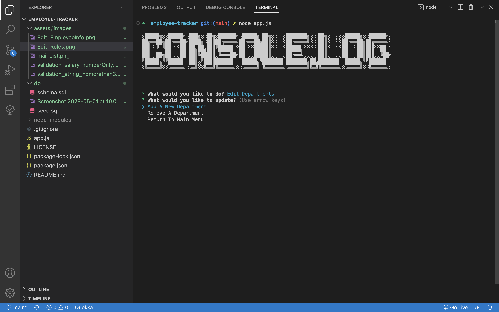
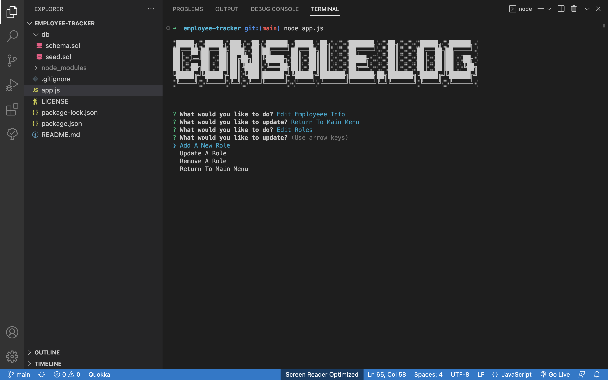
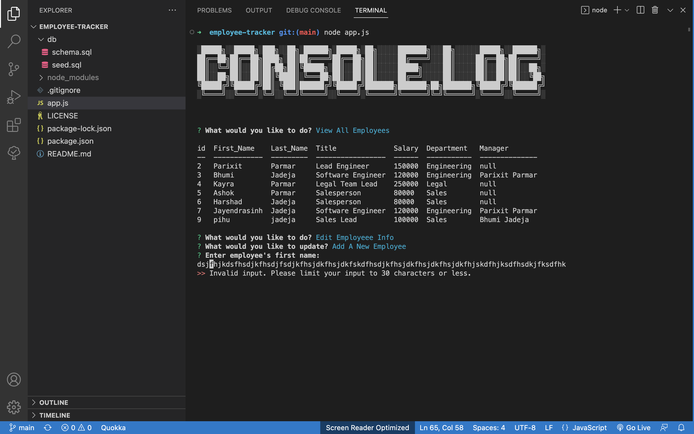
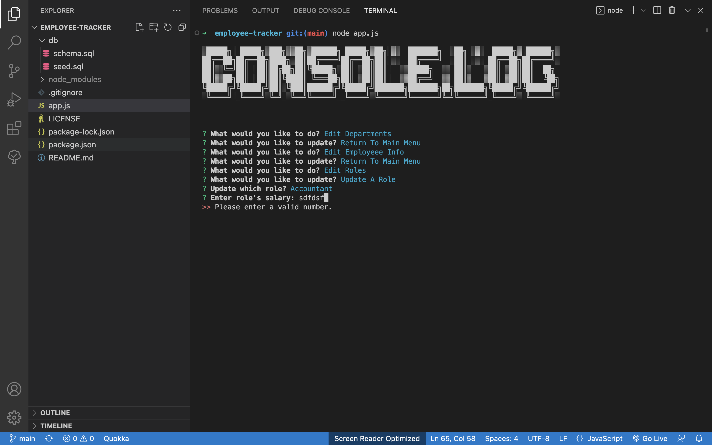
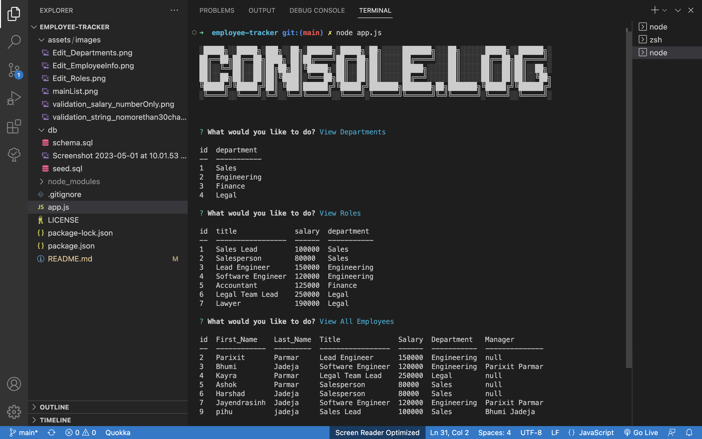

# employee-tracker
A command-line application to manage a company's employee database, using Node.js, Inquirer, and MySQL.

# Description

employee-tracker application is commandline application to manage a company's employee database.So Non develipers ca. easily view and interact with information stored in database.This interfaces are called content management systems(CMS).In employee-tracker application, As a business owner can able to view and mange the departments, roles, and employees in their company.so that Business owner can orangize and plan their business.This is commandline application that accepts user input.
- when user start the application then user can see "View All Employees, Edit Employee Info, View Roles, Edit Roles, View Departments, Edit Departments and quit".
- When user choose "View All Employees" then formatted table showing employee data, including employee ids, first names, last names, job title, salaries, department, manager information.
- When user choose to "view Roles" then formatted table presented with role_id,title, the salary for that role and the department that role belongs to. 
- When user choose "view departments" then formatted table showing department ids and department names.
- when user choose edit departments then user find three options like "Add a new department", "Remove a department", "return to main menu". so in this if user choose "add a new department" then in prompted user have to enter new department name and that department is added to the database. so when again user choose view department then new added department user can see in.when user choose "remove a department" then user have to select one department name form list of department. and when user choose department name and enter then that particular department name is remove from database and thrid option is "return to main menu", so user can see again list of options.
- When user choose "Edit Roles" then again user can see four options like "Add a new role", "Update a role", "Romove a role", "return to main menu".so if user can choose "Add a new role" then user have to enter new role title,enter role's salary and choose the role's department from list which are alreay in database. so now new role is added in role database if user want to see new role then again user have to choose "view roles" option.when user 
select "update role" then user have to select which role from list,then enter role's salary and select role's department from list.so now user can update particular role information.again if user want to see role information is updated or not then user have to choose option view roles.When user choose option "Remove a role" then user have to select which role from list. so particular role which user selected from list is deleted from role database. and last options "return to main menu" so again user see list of options.
- when user choose "Edit Employee Info" then user see five options like "Add a new employee", "Change Employee role", "change Employee Manager", "romove an employee" and "return to main menu". As user choose "Add a new employee" then user can have to enter employee's first name,last name,select employee role from list,choose employee's manager from list. so new employee created in database. if user select "Change Employee role" then user have to select which employee from list, change their role to so in this user can change employee role in database. if user select "Change Employee Manager" then user have to select for which employee and change their manger to in the list. so form this options user can change employee manager. If user choose "Remove an employee" then user have to select which employee to reomve. and in this that particular employee remove from database. and last "return to main menu" means again user see list of options.

In this application, I used inquirer so from prompt user can select and enter values,also I used join to display table in formatted output.Also promised() to handle connection and query, error.mysql to connect database, console.table to display table.Also I did validation like user inputs are not more than 30 characters. when user enter salary it must be in numbers,etc. In db folder I save database and tables in schema.sql file and data in seed.sql file.

- In schema.sql I use employeeDB database and three tables like department, role, employee also define relationship between tables using primary key and foreign key constraints.

- In seed.sql I insert some data using insert query for all three tables.

So through this application I learned about sql queries, how to join database with command prompt,how user can do CRUD opertions(CREATE(add),read(select),update,delete) using command prompt, how to display table using console.table.I improved my knowledge in node.js,inquirer,and mysql.

# Table of Contents

- [Installation](#installation)
- [Usage](#usage)
- [Credits](#credits)
- [License](#license)

## Installation
 
 In this application, I used inquirer, console.table and mysql so user have to follow the steps before run the application.

 1. mysql -u root -p so user can enter in mysql then user have to do
    - source schema.sql and source seed.sql and then quit. this is for initizing database means throgh this user database and table with data is created in database.

2. npm i -y , user can generate pcakage.json file with default values.

3. npm i inquirer@8.2.4, for inquirer modile for prompt method.

4. npm i console.table , for formated table display.

5. npm i mysql , for database connection and query.

6. node app.js to run application.

## Usage

Here I attached somescreenshots and links.

A walkthrough video demonstrating the functionality of the application.-
https://drive.google.com/file/d/1OXYx11l4DZJd1iC6rfmaLo_JKvUzP9oH/view

The URL of the GitHub repository, with a unique name and a README describing the project.-
https://github.com/avanijadeja/employee-tracker

## Credits

for this applicaiton, I read from different websites as under,

1. https://www.w3schools.com

2. https://nodejs.org/en/docs

3. https://dev.mysql.com/doc/

4. https://developer.mozilla.org/en-US/docs/Web/JavaScript/Reference/Global_Objects/Promise

## License

This project is using the MIT License.

## Badges

